# 🏛️ ĐẶC TẢ THIẾT KẾ THỰC THỂ & RÀNG BUỘC ASSET (DYNASSET OBJECT ENTITIES & ERD SPECIFICATION)

Tài liệu này xác định chuẩn hóa **Hệ thống Thực thể (Object Entity Models)**, **Ràng buộc Dữ liệu (Validation Constraints)** và **Sơ đồ Cơ sở Dữ liệu Quan hệ (ERD)** cho hệ sinh thái **DynAsset**. Thiết kế này đảm bảo mọi thao tác Thêm mới (Create), Chỉnh sửa (Update), Lọc (Filter) và Tìm kiếm (Search) trong tương lai đều có tính toàn vẹn cao, tường tận từng thành phần thay vì chỉ lưu chuỗi phẳng (flat string) như Resource Pack truyền thống.

---

## 📑 MỤC LỤC
1. [Phân Loại Thực Thể & Ràng Buộc Thành Phần](#1-phân-loại-thực-thể--ràng-buộc-thành-phần)
2. [Sơ Đồ Thực Thể Quan Hệ (Entity-Relationship Diagram - ERD)](#2-sơ-đồ-thực-thể-quan-hệ-erd)
3. [Chi Tiết Ràng Buộc Từng Loại Đối Tượng (Field Constraints & Rules)](#3-chi-tiết-ràng-buộc-từng-loại-đối-tượng)
4. [Quy Trình Xác Thực Khi Tạo Mới Asset (Validation Lifecycle)](#4-quy-trình-xác-thực-khi-tạo-mới-asset)
5. [Đặc Tả Giao Diện Form Nhập Liệu Tương Ứng (UI Form Spec)](#5-đặc-tả-giao-diện-form-nhập-liệu-tương-ứng)

---

## 1. PHÂN LOẠI THỰC THỂ & RÀNG BUỘC THÀNH PHẦN

Hệ sinh thái DynAsset chia toàn bộ tài nguyên Streaming thành **6 Loại Thực Thể Chính (Primary Entity Types)**:

```mermaid
mindmap
  root((DynAsset Ecosystem))
    🐉 POKEMON_SKIN_BUNDLE
      Texture Base (PNG) [Bắt buộc]
      Model Geometry (GEO.JSON) [Tùy chọn/Bắt buộc nếu custom]
      Poser Definition (JSON) [Tùy chọn/Bắt buộc nếu custom]
      Animation Timeline (ANIMATION.JSON) [Tùy chọn]
      Texture Emissive (PNG) [Tùy chọn]
    ⚔️ ITEM_CUSTOM_MODEL
      Model Structure (JSON) [Bắt buộc]
      Texture Texture (PNG) [Bắt buộc]
      CustomModelData (Integer Index) [Bắt buộc]
    🖼️ GUI_MENU_TEXTURE
      Texture Image (PNG) [Bắt buộc]
      Nine-Slice Border Metadata [Tùy chọn]
    🎵 SOUND_SFX_AUDIO
      Sound Vorbis (OGG) [Bắt buộc]
      Category & Subtitle [Bắt buộc]
    📦 BEDROCK_ENTITY_MODEL
      Geometry Bone Tree (GEO.JSON) [Bắt buộc]
      Texture Map (PNG) [Bắt buộc]
      Entity Animation (ANIMATION.JSON) [Tùy chọn]
    🛡️ ARMOR_LAYER_SET
      Layer 1 Texture (PNG) [Bắt buộc]
      Layer 2 Texture (PNG) [Bắt buộc]
```

---

## 2. SƠ ĐỒ THỰC THỂ QUAN HỆ (ERD)

Mô hình chuẩn hóa tách rời giữa **Bảng Quản Lý Tổng Thể (`dynasset_registry`)**, **Bảng Thành Phần File (`dynasset_components`)** và các **Bảng Thuộc Tính Nghiệp Vụ Chuyên Biệt**:

```mermaid
erDiagram
    DYNASSET_REGISTRY ||--o{ DYNASSET_COMPONENTS : "contains (1-N)"
    DYNASSET_REGISTRY ||--o| DYNASSET_POKEMON_META : "extends (1-1)"
    DYNASSET_REGISTRY ||--o| DYNASSET_ITEM_META : "extends (1-1)"
    DYNASSET_REGISTRY ||--o| DYNASSET_SOUND_META : "extends (1-1)"
    DYNASSET_REGISTRY ||--o| DYNASSET_QUARANTINE : "monitored by (0-1)"

    DYNASSET_REGISTRY {
        varchar(128) asset_id PK "Định danh duy nhất (Slug)"
        varchar(32) target_type "POKEMON, ITEM, GUI, SOUND, MODEL, ARMOR"
        varchar(512) cdn_url "Đường dẫn tải bundle/file từ CDN"
        varchar(64) hash_sha256 "Mã băm toàn vẹn SHA-256"
        bigint file_size_bytes "Dung lượng file"
        varchar(64) author "Tác giả / Nguồn tạo"
        varchar(16) status "ACTIVE, DRAFT, QUARANTINED, ARCHIVED"
        datetime created_at "Thời điểm tạo"
        datetime updated_at "Thời điểm cập nhật cuối"
    }

    DYNASSET_COMPONENTS {
        bigint id PK "Tự tăng"
        varchar(128) asset_id FK "Liên kết DYNASSET_REGISTRY"
        varchar(32) component_role "TEXTURE_BASE, TEXTURE_EMISSIVE, MODEL_GEO, POSER_JSON, ANIMATION_JSON, AUDIO_OGG"
        varchar(256) relative_path "Đường dẫn nội bộ trong pack/bundle"
        varchar(64) file_hash "SHA-256 của file con"
        bigint file_size "Dung lượng file con"
        boolean is_required "Bắt buộc có trong bundle"
    }

    DYNASSET_POKEMON_META {
        varchar(128) asset_id PK,FK "Liên kết DYNASSET_REGISTRY"
        varchar(64) species "Loài Pokémon (ví dụ: miraidon, absol)"
        varchar(128) aspect_name "Tên Aspect đăng ký (ví dụ: dynasset:miraidon_black)"
        text aspect_tags_json "Mảng khía cạnh JSON: ['shiny', 'genderless']"
        varchar(128) model_key "Khóa model trong Cobblemon registry"
        varchar(128) poser_key "Khóa poser trong Cobblemon registry"
        text layers_config_json "Cấu hình multi-layer texture & emissive"
        varchar(32) rarity "COMMON, UNCOMMON, RARE, EPIC, LEGENDARY, EVENT"
    }

    DYNASSET_ITEM_META {
        varchar(128) asset_id PK,FK "Liên kết DYNASSET_REGISTRY"
        varchar(128) base_item "Item Minecraft gốc (ví dụ: minecraft:diamond_sword)"
        int custom_model_data "Số nguyên định danh CMD duy nhất"
        varchar(32) hand_type "ONE_HANDED, TWO_HANDED, SHIELD, HELMET"
        text display_transforms_json "Thông số xoay/scale góc nhìn"
    }

    DYNASSET_SOUND_META {
        varchar(128) asset_id PK,FK "Liên kết DYNASSET_REGISTRY"
        varchar(128) sound_event "Tên sự kiện âm thanh (ví dụ: cobblemon:portal)"
        varchar(32) sound_category "MASTER, MUSIC, RECORDS, WEATHER, NEUTRAL, PLAYERS"
        float default_volume "Âm lượng mặc định (0.0 - 1.0)"
        float default_pitch "Cao độ mặc định (0.5 - 2.0)"
        varchar(128) subtitle_lang_key "Khóa bản dịch phụ đề"
        float duration_seconds "Thời lượng phát"
    }

    DYNASSET_QUARANTINE {
        varchar(128) asset_id PK,FK "Liên kết DYNASSET_REGISTRY"
        varchar(64) error_category "MALFORMED_JSON, CORRUPT_IMAGE, MISSING_DEPENDENCY, HIGH_POLY_LAG"
        text error_detail "Chi tiết lỗi / Stacktrace"
        datetime quarantined_at "Thời điểm kích hoạt bảo vệ"
        boolean auto_isolated "Cách ly tự động bởi Circuit Shield"
    }
```



---

## 3. CHI TIẾT RÀNG BUỘC TỪNG LOẠI ĐỐI TƯỢNG

### 🐉 1. Skin Pokémon (`POKEMON_SKIN_BUNDLE` / `cobblemon_bundle`)
* **Mục đích:** Ngoại trang đặc biệt gắn vào Pokémon trong game theo hệ thống Aspect.
* **Bảng ràng buộc thành phần:**
  | Thành Phần | Định Dạng | Bắt Buộc? | Quy Tắc Hợp Lệ |
  | :--- | :--- | :---: | :--- |
  | **Texture Base** | `.png` | **BẮT BUỘC** | Kích thước lũy thừa 2 (32x32, 64x64, 128x128, 256x256, 512x512). RGBA 8-bit. |
  | **Texture Emissive** | `.png` | Tùy chọn | Cùng độ phân giải với Texture Base; chứa các vùng phát sáng trong đêm. |
  | **Model Geometry** | `.geo.json` | Tùy chọn | Chuẩn Bedrock 1.12.0/1.16.0. Phải có xương gốc (`root` / `body`). Bắt buộc nếu là Custom Mesh. |
  | **Poser Definition**| `.json` | Tùy chọn | Phải trỏ đúng modelKey và chứa các trạng thái: `standing`, `walking`, `faint`. |
  | **Animation** | `.animation.json` | Tùy chọn | Tên animation phải khớp với các pose được khai báo trong poser.json. |
  | **Manifest** | `manifest.json` | **BẮT BUỘC** | Chứa metadata `species`, `aspects`, `layers`. Tự động sinh khi đóng gói zip. |
* **Ràng buộc thuộc tính (Validation Logic):**
  - `species`: Phải tồn tại trong Cobblemon Registry (ví dụ: `miraidon`, `absol`, `pikachu`).
  - `aspect_name`: Chuỗi không dấu, viết thường, tiền tố `dynasset:` (ví dụ: `dynasset:miraidon_black`).

---

### ⚔️ 2. Item Model & Vũ Khí (`ITEM_CUSTOM_MODEL`)
* **Mục đích:** Vật phẩm cầm tay, vũ khí 3D, mũ thời trang, công cụ CustomModelData.
* **Bảng ràng buộc thành phần:**
  | Thành Phần | Định Dạng | Bắt Buộc? | Quy Tắc Hợp Lệ |
  | :--- | :--- | :---: | :--- |
  | **Item Model JSON** | `.json` | **BẮT BUỘC** | Chuẩn Vanilla Item Model (`textures`, `elements`, `display`). |
  | **Texture Map** | `.png` | **BẮT BUỘC** | Khớp đường dẫn texture được khai báo bên trong file Model JSON. |
* **Ràng buộc thuộc tính:**
  - `base_item`: Phải là item hợp lệ trong `BuiltInRegistries.ITEM` (ví dụ: `minecraft:diamond_sword`, `minecraft:stick`).
  - `custom_model_data`: Số nguyên dương $> 0$. Không được trùng lặp với bất kỳ asset nào khác trên cùng một `base_item`.

---

### 🖼️ 3. GUI & Menu Texture (`GUI_MENU_TEXTURE`)
* **Mục đích:** Giao diện tùy chỉnh, thanh tiến trình BattlePass, khung thoại NPC, nút bấm HUD.
* **Bảng ràng buộc thành phần:**
  | Thành Phần | Định Dạng | Bắt Buộc? | Quy Tắc Hợp Lệ |
  | :--- | :--- | :---: | :--- |
  | **Image Texture** | `.png` | **BẮT BUỘC** | Tối đa 2048x2048px. Tỷ lệ chuẩn tối ưu bộ nhớ GPU. |
* **Ràng buộc thuộc tính:**
  - `namespace_path`: Đường dẫn ảo bắt đầu bằng namespace (ví dụ: `battlepass/textures/ui/bp.png`).

---

### 🎵 4. Hiệu Ứng Âm Thanh (`SOUND_SFX_AUDIO`)
* **Mục đích:** Tiếng kêu skill, âm thanh sự kiện, tiếng nhạc nền BGM.
* **Bảng ràng buộc thành phần:**
  | Thành Phần | Định Dạng | Bắt Buộc? | Quy Tắc Hợp Lệ |
  | :--- | :--- | :---: | :--- |
  | **Audio Vorbis** | `.ogg` | **BẮT BUỘC** | Chuẩn codec Ogg Vorbis, tần số lấy mẫu 44.1kHz hoặc 48kHz, mono/stereo. |
* **Ràng buộc thuộc tính:**
  - `sound_category`: Một trong các giá trị chuẩn: `MASTER`, `MUSIC`, `RECORDS`, `WEATHER`, `NEUTRAL`, `PLAYERS`.
  - `duration_seconds`: $\le 300$ giây đối với SFX (để tránh tràn bộ nhớ âm thanh).

---

### 📦 5. Model 3D Độc Lập / Boss Entity (`BEDROCK_ENTITY_MODEL`)
* **Mục đích:** Quái vật thế giới, Boss Custom, NPC đặc biệt.
* **Bảng ràng buộc thành phần:**
  | Thành Phần | Định Dạng | Bắt Buộc? | Quy Tắc Hợp Lệ |
  | :--- | :--- | :---: | :--- |
  | **Geometry Mesh** | `.geo.json` | **BẮT BUỘC** | Cấu trúc xương Bedrock JSON chuẩn. |
  | **Texture Skin** | `.png` | **BẮT BUỘC** | Đúng UV mapping với Geometry Mesh. |
  | **Animation** | `.animation.json` | Tùy chọn | Chứa chuyển động `idle`, `walk`, `attack`. |

---

## 4. QUY TRÌNH XÁC THỰC KHI TẠO MỚI ASSET (VALIDATION LIFECYCLE)

Khi Admin hoặc hệ thống nạp một asset mới, quy trình kiểm duyệt tự động diễn ra theo 4 bước nghiêm ngặt:

```text
[Nhập Dữ Liệu Thô]
        ↓
1. KIỂM TRA ĐỊNH DẠNG (Format Integrity)
   • Kiểm tra đuôi file (.png, .geo.json, .json, .ogg, .zip).
   • Xác thực cấu trúc file JSON hợp lệ, không lỗi cú pháp.
        ↓
2. KIỂM TRA RÀNG BUỘC PHÂN LOẠI (Polymorphic Constraints)
   • Nếu là POKEMON: Bắt buộc có Texture Base + Species hợp lệ trong Cobblemon.
   • Nếu là ITEM: Bắt buộc có Model JSON + Base Item hợp lệ + CMD duy nhất.
   • Nếu là SOUND: Bắt buộc là file .ogg Vorbis.
        ↓
3. QUÉT AN TOÀN CIRCUIT SHIELD (Safety & Performance Scan)
   • Quét kích thước file (Chống Zip Bomb / Texture quá 4096px gây văng RAM).
   • Quét cấu trúc LayerDefinition chống crash OpenGL.
        ↓
4. ĐÓNG GÓI & GHI DATABASE (Atomic Commit)
   • Tự động tính SHA-256.
   • Ghi vào dynasset_registry + dynasset_components.
   • Xuất file tĩnh lên CDN và sẵn sàng cho On-Demand Streaming!
```

---

## 5. ĐẶC TẢ GIAO DIỆN FORM NHẬP LIỆU TƯƠNG ỨNG (UI FORM SPEC)

Trên giao diện **Modal Thêm Mới / Chỉnh Sửa Asset (Owo-UI)**, form sẽ **tự động chuyển đổi các trường nhập liệu tương ứng (Dynamic Form Switching)** khi người dùng chọn `Target Type`:

### 🎨 1. Khi chọn Loại: `🐉 Pokémon Skin`:
- 🔲 **Asset ID (Slug):** `[ miraidon_cyberpunk ]` *(Tự động format chữ thường + gạch dưới)*
- 🔲 **Loài Pokémon (Species):** `[ miraidon ▾ ]` *(Dropdown tìm kiếm loài từ Cobblemon)*
- 🔲 **Texture Chính (Base PNG):** `[ File picker / CDN URL ]` *(Bắt buộc)*
- 🔲 **Texture Phát Sáng (Emissive PNG):** `[ File picker / CDN URL ]` *(Tùy chọn)*
- 🔲 **Model 3D (.geo.json):** `[ File picker / Mặc định loài ]` *(Tùy chọn)*
- 🔲 **Poser (.json):** `[ File picker / Mặc định loài ]` *(Tùy chọn)*
- 🔲 **Animation (.animation.json):** `[ File picker / Mặc định loài ]` *(Tùy chọn)*
- 🔲 **Độ Hiếm (Rarity):** `[ 🌟 Legendary ▾ ]`

### 🎨 2. Khi chọn Loại: `⚔️ Item Model / Vũ Khí`:
- 🔲 **Asset ID (Slug):** `[ dragon_katana_3d ]`
- 🔲 **Vật phẩm gốc (Base Item):** `[ minecraft:netherite_sword ▾ ]`
- 🔲 **CustomModelData Index:** `[ 10042 ]` *(Hệ thống tự gợi ý số index chưa dùng)*
- 🔲 **Model JSON:** `[ File picker / CDN URL ]` *(Bắt buộc)*
- 🔲 **Texture PNG:** `[ File picker / CDN URL ]` *(Bắt buộc)*

### 🎨 3. Khi chọn Loại: `🎵 Âm Thanh / SFX`:
- 🔲 **Asset ID (Slug):** `[ sound_skill_thunderstorm ]`
- 🔲 **Audio File (.ogg):** `[ File picker / CDN URL ]` *(Bắt buộc)*
- 🔲 **Danh Mục (Category):** `[ 🎵 PLAYERS ▾ ]`
- 🔲 **Âm lượng mặc định:** `[ Slider: 1.0 ]`

---

## 🎯 TỔNG KẾT GIÁ TRỊ THIẾT KẾ
1. **Chống Lỗi Tận Gốc:** Không bao giờ xảy ra tình trạng thiếu file texture hoặc sai cấu trúc model làm văng game client.
2. **Tìm Kiếm & Lọc Thông Minh:** Có thể lọc Pokémon theo Loài, Item theo BaseItem/CMD, Âm thanh theo Thể loại trực tiếp trong Database.
3. **Mở Rộng Dễ Dàng:** Khi thêm các thực thể mới (Particle VFX, Cosmetic Capes, UI Shaders), chỉ cần định nghĩa thêm schema component con mà không ảnh hưởng đến kiến trúc lõi.
